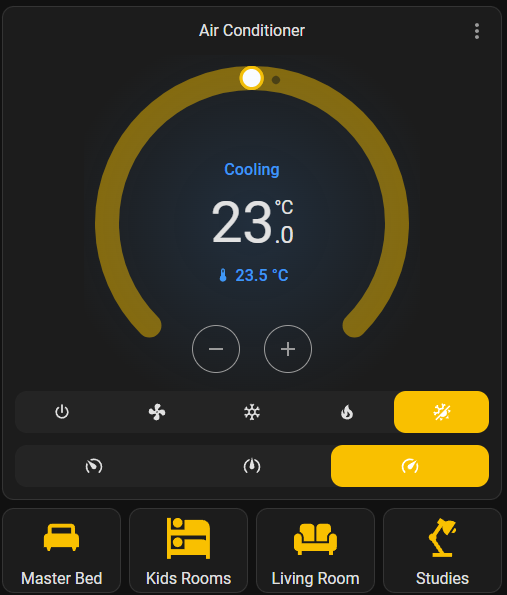

# Actron Connect - Home Assistant Integration

## Description

This is a custom component for Home Assistant to allow integration with Actron Connect devices. It is compatible with the following devices:

- Actron Standard Classic
- Actron ESP Plus
- Actron ESP Ultima
- Actron Platinum Plus
- Actron Platinum Ultima

It is not compatible with Actron Neo or Que devices.

## Features

This integration relies on a combination of local polling of the device and a connection to the Actron Connect cloud service to provide its functionality.

Via local polling to the device itself:

- On/off status
- Inside temperature
- Target temperature
- AC mode (cool, heat, fan only, auto)
- Compressor activity (heating, cooling, idle)
- Fan speed (low, medium, high)

Via the Actron Connect cloud service:

- General device information
- Automatic zone configuration, including zone names
- Turn device on or off
- Turn individual zones on or off
- Set AC mode (cool, heat, fan only, auto)
- Set fan speed (low, medium, high)

The integration uses the standard `climate` entity type, which is compatible with the built-in `Thermostat` dashboard card. Zone information is not available on the `Thermostat` card, but can be accessed and controlled via the standard `Switch` entities the integration exposes.

Integration entries overview:


Device information:


Dashboard thermostat card:



## Limitations

Due to limitations with the Actron Connect API, it is currently not possible to put the device in ESP mode, or to enable continuous fan speed.

## Installation

## Device Setup

How to add hvac modes and fan speeds to the thermostat card

```yaml
type: vertical-stack
cards:
  - type: thermostat
    entity: climate.aconnect6827193ea688_climate
    features:
      - type: climate-hvac-modes
      - style: icons
        type: climate-fan-modes
    name: Air Conditioner
  - type: horizontal-stack
    cards:
      - show_name: true
        show_icon: true
        type: button
        entity: switch.aconnect6827193ea688_zone_master_bed
        name: Master Bed
        icon: mdi:bed-queen
      - show_name: true
        show_icon: true
        type: button
        entity: switch.aconnect6827193ea688_zone_kids_rooms
        name: Kids Rooms
        icon: mdi:bunk-bed
      - show_name: true
        show_icon: true
        type: button
        entity: switch.aconnect6827193ea688_zone_living_room
        name: Living Room
        icon: mdi:sofa
      - show_name: true
        show_icon: true
        type: button
        entity: switch.aconnect6827193ea688_zone_studies
        name: Studies
        icon: mdi:desk-lamp


```

## Uninstallation

## Future development
The integration does not have a logo yet, but this is being worked on.

This integration has only been tested with one device so far, so I am not comfortable releasing it to the Home Assistant integration store yet. This will be done once some feedback has been received by more users on a variety of devices.

The `Thermostat` card does not currently support turning the device on and off other than by using the AC modes. It also doesn't support turning individual zones on and off. The next step is to develop a custom card that supports those features, but for now the workaround is to 

